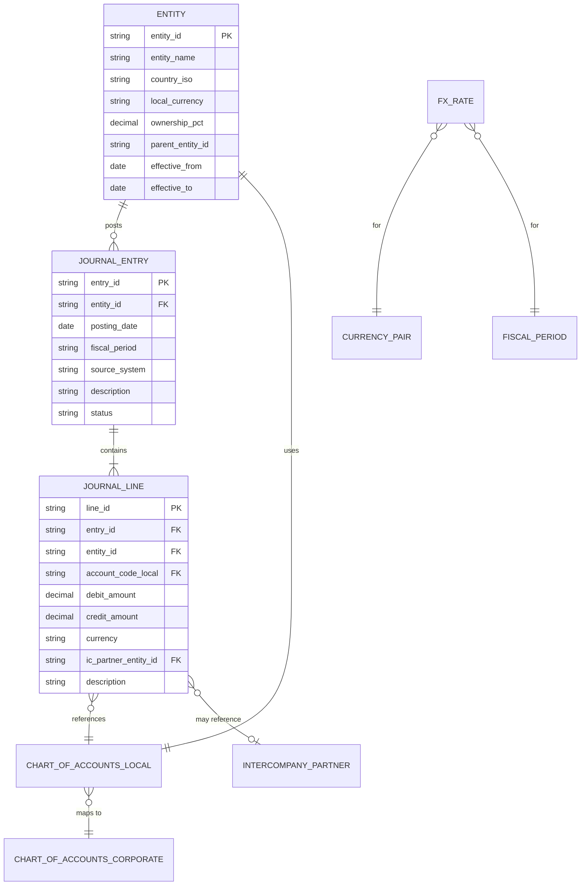
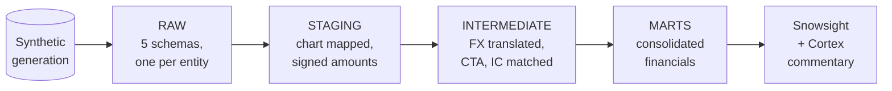

# ConsolidAR — Data Model

This document is the logical data model for ConsolidAR. It describes the
domain entities, their relationships, and the columns of each table at each
layer of the warehouse. Physical types (Snowflake-specific) are deferred to
the DDL files under `snowflake/ddl/`.

The document is structured as:

1. [Domain overview](#1-domain-overview)
2. [Layer architecture](#2-layer-architecture)
3. [RAW layer](#3-raw-layer)
4. [STAGING layer](#4-staging-layer)
5. [INTERMEDIATE layer](#5-intermediate-layer)
6. [MARTS layer](#6-marts-layer)
7. [Granularity reference](#7-granularity-reference)
8. [Key design decisions](#8-key-design-decisions)

---

## 1. Domain overview

ConsolidAR consolidates the books of five subsidiaries of the fictional
**Andina Holdings** group into a single set of financial statements
expressed in USD.

### Group structure

| Entity ID | Entity Name           | Country | Local CCY | Ownership | Industry      |
| --------- | --------------------- | ------- | --------- | --------- | ------------- |
| `AR_HOLD` | Andina Holdings SA    | AR      | ARS       | Parent    | Holding       |
| `BR_RET`  | Andina Brasil Ltda    | BR      | BRL       | 100%      | Retail        |
| `CL_RET`  | Andina Chile SpA      | CL      | CLP       | 100%      | Retail        |
| `PE_MFG`  | Andina Perú SAC       | PE      | PEN       | 80%       | Manufacturing |
| `US_DIST` | Andina USA Inc        | US      | USD       | 100%      | Distribution  |

**Presentation currency:** USD. The parent's local books are ARS, but the
consolidated statements are presented in USD. This means the parent itself
is subject to translation in the consolidation process, exactly like any
other foreign subsidiary.

### Period scope

- **Fiscal periods:** 24 monthly periods, `202401` through `202512`.
- **Reporting calendar:** calendar year, monthly closes.
- **Period format:** `YYYYMM` as 6-char string. Used everywhere as the
  primary time grain.

### Intercompany flows modeled

| From      | To        | Nature                                           |
| --------- | --------- | ------------------------------------------------ |
| `AR_HOLD` | All subs  | Management fees (monthly, fixed + % of revenue)  |
| `PE_MFG`  | `US_DIST` | Inventory sales (manufactured goods → distributor) |
| `BR_RET`  | `CL_RET`  | Inventory transfers (cross-border retail)        |
| `US_DIST` | `AR_HOLD` | Royalty fees                                     |
| Various   | Various   | Intercompany loans + interest                    |

These produce intercompany receivables/payables and intercompany
revenue/expense pairs that must net to zero on consolidation.

---

## 2. Layer architecture

| Layer        | Snowflake schema(s)                              | Owner / writer       | Reader scope                |
| ------------ | ------------------------------------------------ | -------------------- | --------------------------- |
| RAW          | `RAW_AR`, `RAW_BR`, `RAW_CL`, `RAW_PE`, `RAW_US` | data generation job  | dbt staging only            |
| STAGING      | `STG`                                            | dbt                  | dbt int and marts           |
| INTERMEDIATE | `INT`                                            | dbt + Dynamic Tables | dbt marts                   |
| MARTS        | `MARTS`                                          | dbt + Dynamic Tables | BI / Snowsight / Cortex     |
| REFERENCE    | `FX_DATA`, `CORP_REF`                            | data generation job  | all layers                  |

**Row access policies** are applied at the RAW layer on `entity_id`. The
STG, INT, and MARTS layers inherit the security model through views and
dbt-managed tables, but the privilege model is centered on RAW.

---

## 3. RAW layer

The RAW layer holds the data as it would arrive from each subsidiary's
source system — five separate ERPs, five separate charts of accounts, five
local currencies. Each entity gets its own schema. A row access policy on
`entity_id` ensures that an entity user can only read their own schema.

### 3.1 `raw_{entity}.journal_entries`

Header of an accounting journal entry. One row per posted entry per entity.

| Column           | Logical type      | PK/FK | Description                                                |
| ---------------- | ----------------- | ----- | ---------------------------------------------------------- |
| `entry_id`       | string(20)        | PK    | Unique within an entity. Format: `{entity}-{seq}`.         |
| `entity_id`      | string(10)        |       | Always matches the schema. Redundant but useful downstream.|
| `posting_date`   | date              |       | Date of the accounting event.                              |
| `fiscal_period`  | string(6)         |       | YYYYMM of `posting_date`. Pre-computed for partitioning.   |
| `source_system`  | string(20)        |       | `ERP_SAP_R3`, `ERP_ORACLE`, `ERP_LOCAL`, etc.              |
| `entry_type`     | string(20)        |       | `STANDARD`, `ADJUSTMENT`, `RECLASS`, `CLOSING`.            |
| `description`    | string(200)       |       | Free-text narrative.                                       |
| `posted_by`      | string(50)        |       | User ID of poster.                                         |
| `posted_at`      | timestamp         |       | System timestamp of posting.                               |
| `status`         | string(20)        |       | `POSTED`, `REVERSED`, `DRAFT`.                             |
| `reversed_by_id` | string(20) (null) | FK    | If `status='REVERSED'`, the entry that reversed this one.  |

**Grain:** one row per journal entry header per entity.

**Notes:**
- `entity_id` is denormalized into the row even though it is implied by the
  schema. This is intentional: when the staging layer unions all five
  schemas, the column is already present and no `case when current_schema...`
  acrobatics are needed.

### 3.2 `raw_{entity}.journal_lines`

Detail of a journal entry. One row per debit or credit line.

| Column                  | Logical type      | PK/FK | Description                                                          |
| ----------------------- | ----------------- | ----- | -------------------------------------------------------------------- |
| `line_id`               | string(24)        | PK    | Format: `{entry_id}-{line_no}`.                                      |
| `entry_id`              | string(20)        | FK    | References `journal_entries.entry_id`.                               |
| `entity_id`             | string(10)        |       | Denormalized for the same reason as above.                           |
| `line_no`               | int               |       | Sequence within the entry (1, 2, 3, …).                              |
| `account_code_local`    | string(20)        | FK    | Local chart-of-accounts code. Format varies by entity.               |
| `debit_amount`          | decimal(18,2)     |       | In local currency. Zero or null if this line is a credit.            |
| `credit_amount`         | decimal(18,2)     |       | In local currency. Zero or null if this line is a debit.             |
| `currency`              | string(3)         |       | ISO 4217. Always the entity's local currency at the RAW layer.       |
| `ic_partner_entity_id`  | string(10) (null) | FK    | Counterparty entity if this line is intercompany. Else null.         |
| `ic_partner_account`    | string(20) (null) |       | Counterparty account code on the partner's books, if known.          |
| `description`           | string(200)       |       | Line-level narrative.                                                |
| `cost_center`           | string(20) (null) |       | Optional dimension. Used for management reporting, not consolidation.|
| `project_code`          | string(20) (null) |       | Optional dimension.                                                  |

**Grain:** one row per debit or credit per entry per entity.

**Notes:**
- The dual-column `(debit_amount, credit_amount)` representation matches the
  way ERPs export data (SAP, Oracle, NetSuite all do this). The staging
  layer collapses this into a single signed amount.
- Within an entry, the sum of debits equals the sum of credits in local
  currency. This is an integrity constraint enforced by a dbt test.
- An intercompany line has `ic_partner_entity_id` populated. The actual
  matching to the counterparty entity's line happens in the INT layer with
  a Snowpark UDF.

### 3.3 `raw_{entity}.chart_of_accounts_local`

The entity's local chart of accounts. Slowly-changing.

| Column                   | Logical type | PK/FK | Description                                                  |
| ------------------------ | ------------ | ----- | ------------------------------------------------------------ |
| `account_code_local`     | string(20)   | PK    | Local code, format varies (e.g., `5.1.01.001` in BR).        |
| `entity_id`              | string(10)   |       | Denormalized.                                                |
| `account_name_local`     | string(200)  |       | In the entity's local language.                              |
| `account_name_english`   | string(200)  |       | English translation for analyst readability.                 |
| `account_type`           | string(20)   |       | `ASSET`, `LIABILITY`, `EQUITY`, `REVENUE`, `EXPENSE`.        |
| `account_subtype`        | string(40)   |       | `CURRENT_ASSET`, `NON_CURRENT_ASSET`, `OPERATING_REVENUE`, etc. |
| `is_intercompany_natural`| boolean      |       | True if this account exists specifically for IC postings.    |
| `normal_balance`         | string(1)    |       | `D` (debit) or `C` (credit). Derived from `account_type`.    |
| `active`                 | boolean      |       | True if usable in postings.                                  |
| `effective_from`         | date         |       | SCD2.                                                        |
| `effective_to`           | date (null)  |       | SCD2. Null if currently active.                              |

**Grain:** one row per local account code per validity period.

### 3.4 `fx_data.fx_rates`

Centralized FX rate table. Not per-entity — one schema serves all.

| Column            | Logical type     | PK/FK | Description                                                  |
| ----------------- | ---------------- | ----- | ------------------------------------------------------------ |
| `from_currency`   | string(3)        | PK    | ISO 4217.                                                    |
| `to_currency`     | string(3)        | PK    | Always `USD` in scope, but kept flexible.                    |
| `rate_date`       | date             | PK    | Date for which the rate is quoted.                           |
| `rate_type`       | string(20)       | PK    | `CLOSING`, `AVERAGE`, `HISTORICAL`.                          |
| `rate`            | decimal(18,8)    |       | Value of 1 unit of `from_currency` in `to_currency`.         |
| `source`          | string(50)       |       | Data provider (`ECB`, `exchangerate.host`, etc.).            |
| `loaded_at`       | timestamp        |       | System timestamp of load. Drives Streams + Tasks.            |

**Grain:** one row per (from_currency, to_currency, rate_date, rate_type).

**Notes:**
- `CLOSING` rates are daily.
- `AVERAGE` rates are quoted with `rate_date = last day of month` and
  represent the simple average of the closing rates in that month.
- `HISTORICAL` rates are used for equity translation. One row per equity
  movement event date.
- `fx_rates` is the trigger source for the Dynamic Table refresh of
  `int_translated_balances`.

### 3.5 `corp_ref.entities`

Reference table describing the group structure. Slowly-changing.

| Column                | Logical type      | PK/FK | Description                                                |
| --------------------- | ----------------- | ----- | ---------------------------------------------------------- |
| `entity_id`           | string(10)        | PK    | Stable identifier.                                         |
| `entity_name`         | string(100)       |       | Legal name.                                                |
| `country_iso`         | string(2)         |       | ISO 3166-1 alpha-2.                                        |
| `local_currency`      | string(3)         |       | ISO 4217. Functional currency by assumption.               |
| `functional_currency` | string(3)         |       | Equals `local_currency` for this dataset (see ADR 0002).   |
| `parent_entity_id`    | string(10) (null) | FK    | Self-reference. Null for the top parent.                   |
| `ownership_pct`       | decimal(5,4)      |       | Parent's ownership share. 1.0000 = 100%.                   |
| `consolidation_method`| string(20)        |       | `FULL`, `EQUITY`, `PROPORTIONAL`. Always `FULL` here.      |
| `effective_from`      | date              |       | SCD2.                                                      |
| `effective_to`        | date (null)       |       | SCD2.                                                      |

**Grain:** one row per entity per validity period.

### 3.6 `corp_ref.chart_of_accounts_corporate`

The corporate (consolidated) chart of accounts. Every local account maps to
exactly one corporate account.

| Column                       | Logical type | PK/FK | Description                                                |
| ---------------------------- | ------------ | ----- | ---------------------------------------------------------- |
| `account_code_corporate`     | string(10)   | PK    | Corporate code. Format: 4-digit numeric (e.g., `1100`).    |
| `account_name`               | string(100)  |       | In English.                                                |
| `account_type`               | string(20)   |       | Mirrors local; must agree.                                 |
| `account_subtype`            | string(40)   |       |                                                             |
| `statement_line`             | string(50)   |       | Line on the financial statement (`Cash`, `Trade AR`, etc.).|
| `presentation_order`         | int          |       | Display order on statements.                               |
| `is_intercompany_eliminable` | boolean      |       | True if intercompany balances on this account eliminate on consolidation. |

**Grain:** one row per corporate account.

### 3.7 `corp_ref.coa_local_to_corporate_mapping`

Mapping from local CoA codes to corporate CoA codes.

| Column                   | Logical type | PK/FK | Description                                          |
| ------------------------ | ------------ | ----- | ---------------------------------------------------- |
| `entity_id`              | string(10)   | PK    |                                                      |
| `account_code_local`     | string(20)   | PK    |                                                      |
| `account_code_corporate` | string(10)   | FK    | References `chart_of_accounts_corporate`.            |
| `mapping_effective_from` | date         | PK    | SCD2.                                                |
| `mapping_effective_to`   | date (null)  |       |                                                      |

**Grain:** one row per (entity, local account, validity period).

### 3.8 `corp_ref.intercompany_partner_accounts`

Catalog of which local accounts are intercompany "natural" accounts and what
their counterparty pattern is. Used as a hint by the matching UDF.

| Column                       | Logical type | PK/FK | Description                                            |
| ---------------------------- | ------------ | ----- | ------------------------------------------------------ |
| `entity_id`                  | string(10)   | PK    |                                                        |
| `account_code_local`         | string(20)   | PK    |                                                        |
| `expected_partner_entity_id` | string(10)   |       | Most common counterparty. Null if generic.             |
| `expected_partner_account`   | string(20)   |       | Counterparty account.                                  |
| `match_priority`             | int          |       | 1 = highest. Used to break ties in the matching UDF.   |

**Grain:** one row per IC account per entity.

---

## 4. STAGING layer

The staging layer unions the five RAW schemas into a single canonical view,
maps local accounts to corporate accounts, and collapses the
`(debit_amount, credit_amount)` pair into a single signed amount.

### 4.1 `stg.stg_journal_lines`

| Column                   | Logical type      | Source                                       |
| ------------------------ | ----------------- | -------------------------------------------- |
| `line_id`                | string(24)        | RAW                                          |
| `entry_id`               | string(20)        | RAW                                          |
| `entity_id`              | string(10)        | RAW                                          |
| `posting_date`           | date              | joined from `journal_entries`                |
| `fiscal_period`          | string(6)         | joined from `journal_entries`                |
| `account_code_local`     | string(20)        | RAW                                          |
| `account_code_corporate` | string(10)        | joined via `coa_local_to_corporate_mapping`  |
| `account_type`           | string(20)        | joined via `chart_of_accounts_corporate`     |
| `account_subtype`        | string(40)        | joined via `chart_of_accounts_corporate`     |
| `signed_amount_local`    | decimal(18,2)     | `debit_amount - credit_amount`               |
| `currency_local`         | string(3)         | RAW                                          |
| `is_intercompany`        | boolean           | `ic_partner_entity_id is not null`           |
| `ic_partner_entity_id`   | string(10) (null) | RAW                                          |
| `description`            | string(200)       | RAW                                          |
| `source_system`          | string(20)        | joined from `journal_entries`                |
| `entry_type`             | string(20)        | joined from `journal_entries`                |

**Grain:** one row per journal line, group-wide.

**Sign convention:**

`signed_amount_local = debit_amount - credit_amount`.

This is the **natural balance** convention — a positive amount means a debit
posting, a negative amount means a credit posting. Whether this represents
"good news" or "bad news" depends on the account's normal balance.

For analytical reporting (income statement, variance analysis), the marts
layer applies a sign normalization based on `account_type` so that revenue
shows as positive and expense as positive. That logic is **out of staging**
to avoid confusing the raw accounting representation with the presentation
representation.

### 4.2 `stg.stg_entities`, `stg.stg_fx_rates`, `stg.stg_chart_of_accounts_corporate`

Thin wrappers over the corresponding reference tables, applying SCD2
filtering (`where effective_to is null` for current-as-of) and renaming
columns for downstream consistency. One row per current-effective record.

---

## 5. INTERMEDIATE layer

This is where the Snowflake-native features start carrying weight.

### 5.1 `int.int_translated_balances` *(Dynamic Table)*

For each staging journal line, applies the appropriate FX rate based on
account_type and produces a USD amount.

| Column                   | Logical type      | Notes                                                       |
| ------------------------ | ----------------- | ----------------------------------------------------------- |
| (all staging columns)    |                   | Pass-through                                                |
| `fx_rate_type_applied`   | string(20)        | `CLOSING`, `AVERAGE`, or `HISTORICAL`                       |
| `fx_rate_value`          | decimal(18,8)     | The rate used                                               |
| `fx_rate_date`           | date              | The rate's effective date                                   |
| `signed_amount_usd`      | decimal(18,2)     | `signed_amount_local * fx_rate_value`                       |
| `translation_method`     | string(20)        | Always `CURRENT_RATE` in this dataset                       |

**Grain:** one row per staging journal line.

**Rate selection rule (per current-rate method, ADR 0002):**

| `account_type` | Rate type applied                  |
| -------------- | ---------------------------------- |
| `ASSET`        | `CLOSING` at period end            |
| `LIABILITY`    | `CLOSING` at period end            |
| `EQUITY`       | `HISTORICAL` at transaction date   |
| `REVENUE`      | `AVERAGE` for the period           |
| `EXPENSE`      | `AVERAGE` for the period           |

**Refresh:** Dynamic Table with `TARGET_LAG = 1 minute`. Re-translates when
either upstream lines change or new FX rates land.

### 5.2 `int.int_cta_movements`

Calculates the CTA per entity per period (see ADR 0002 for the method).

| Column                       | Logical type    | Notes                                                                      |
| ---------------------------- | --------------- | -------------------------------------------------------------------------- |
| `entity_id`                  | string(10)      |                                                                            |
| `fiscal_period`              | string(6)       |                                                                            |
| `local_currency`             | string(3)       |                                                                            |
| `presentation_currency`      | string(3)       | Always `USD`                                                               |
| `period_translated_debits`   | decimal(18,2)   | Sum of debits in USD using line-level rates                                |
| `period_translated_credits`  | decimal(18,2)   | Sum of credits in USD using line-level rates                               |
| `period_cta_usd`             | decimal(18,2)   | `period_translated_credits - period_translated_debits` (the plug)          |
| `opening_cta_usd`            | decimal(18,2)   | Cumulative CTA up to start of period                                       |
| `closing_cta_usd`            | decimal(18,2)   | `opening_cta_usd + period_cta_usd`                                         |

**Grain:** one row per (entity, fiscal_period).

### 5.3 `int.int_cta_journal`

Emits CTA as journal lines in the same shape as regular journal lines, so
that the marts layer can treat CTA uniformly.

Schema matches `stg.stg_journal_lines` with:
- `entity_id` = the entity for which CTA is being posted
- `account_code_corporate` = `3900` (Accumulated CTA)
- `source_system` = `CONSOLIDATION`
- `entry_type` = `CTA_POSTING`

**Grain:** one row per non-zero CTA posting per entity per period (typically
one line per entity per period).

### 5.4 `int.int_ic_lines_classified`

Filters the translated balances down to intercompany lines only and prepares
them for matching.

| Column                       | Logical type    | Notes                                                |
| ---------------------------- | --------------- | ---------------------------------------------------- |
| (translated balance columns) |                 | Subset, IC lines only                                |
| `match_key_amount_bucket`    | int             | `signed_amount_usd` rounded to nearest $100 for fuzzy match |
| `match_priority`             | int             | From `intercompany_partner_accounts`                 |

**Grain:** one row per IC line.

### 5.5 `int.int_ic_matched` and `int.int_ic_unmatched` *(Snowpark UDF output)*

The intercompany matching algorithm (Snowpark Python UDF) takes
`int_ic_lines_classified` and produces two outputs:

**`int_ic_matched`:**

| Column                   | Logical type    | Notes                                                |
| ------------------------ | --------------- | ---------------------------------------------------- |
| `match_id`               | string(36)      | UUID for the matched pair                            |
| `line_id_side_a`         | string(24)      | FK to `stg_journal_lines.line_id`                    |
| `line_id_side_b`         | string(24)      | FK to `stg_journal_lines.line_id`                    |
| `entity_id_side_a`       | string(10)      |                                                      |
| `entity_id_side_b`       | string(10)      |                                                      |
| `amount_usd_side_a`      | decimal(18,2)   |                                                      |
| `amount_usd_side_b`      | decimal(18,2)   |                                                      |
| `amount_difference_usd`  | decimal(18,2)   | Should be near zero. Non-zero is an FX timing diff.  |
| `match_method`           | string(40)      | `EXACT_AMOUNT_AND_PARTNER`, `FUZZY_AMOUNT`, etc.     |
| `confidence_score`       | decimal(5,4)    | 0–1                                                  |
| `matched_at`             | timestamp       |                                                      |

**Grain:** one row per matched pair of IC lines.

**`int_ic_unmatched`:**

Subset of `int_ic_lines_classified` for lines that the UDF could not match,
plus a `unmatched_reason` column (`NO_COUNTERPARTY`, `AMOUNT_MISMATCH`,
`PERIOD_MISMATCH`, etc.). One row per unmatched IC line. This becomes a
dbt test failure threshold and a key FP&A operational metric.

### 5.6 `int.int_ic_elimination_journal`

For each matched pair, emits two reversing journal lines that eliminate the
IC balance on consolidation.

Schema matches `stg.stg_journal_lines` with `source_system = 'CONSOLIDATION'`
and `entry_type = 'IC_ELIMINATION'`. One row per side of each matched pair.

### 5.7 `int.int_nci_movements`

Calculates non-controlling interest for entities with `ownership_pct < 1.0`.
In this dataset, only `PE_MFG` qualifies (80% ownership → 20% NCI).

| Column                  | Logical type    | Notes                                              |
| ----------------------- | --------------- | -------------------------------------------------- |
| `entity_id`             | string(10)      |                                                    |
| `fiscal_period`         | string(6)       |                                                    |
| `entity_net_income_usd` | decimal(18,2)   |                                                    |
| `nci_pct`               | decimal(5,4)    | `1 - ownership_pct`                                |
| `nci_share_of_ni`       | decimal(18,2)   | P&L attributable to NCI                            |
| `nci_balance_sheet_usd` | decimal(18,2)   | NCI equity component                               |

**Grain:** one row per (NCI-eligible entity, fiscal_period).

---

## 6. MARTS layer

The consumption layer. These are what Snowsight dashboards and Cortex
commentary read from.

### 6.1 `marts.consolidated_trial_balance` *(Dynamic Table)*

The single source of truth for the consolidated group. Union of:
- `int_translated_balances` (entity-level postings)
- `int_cta_journal` (CTA postings)
- `int_ic_elimination_journal` (IC eliminations)

| Column                   | Logical type    | Notes                                              |
| ------------------------ | --------------- | -------------------------------------------------- |
| `entity_id`              | string(10)      | `CONSOLIDATED` for elimination and CTA lines       |
| `fiscal_period`          | string(6)       |                                                    |
| `account_code_corporate` | string(10)      |                                                    |
| `account_type`           | string(20)      |                                                    |
| `signed_amount_usd`      | decimal(18,2)   |                                                    |
| `source_layer`           | string(20)      | `ENTITY`, `CTA`, `IC_ELIM`                         |

**Grain:** one row per posting line.

**Critical invariant:** when grouped by `fiscal_period`, the sum of
`signed_amount_usd` across all accounts must be zero. This is the
consolidation "closes to zero" test — a hard pass/fail check enforced via
dbt test `assert_consolidated_tb_balances_to_zero`.

### 6.2 `marts.consolidated_income_statement`

Aggregation of `consolidated_trial_balance` by `account_type in ('REVENUE',
'EXPENSE')` with sign normalization for presentation.

| Column                   | Logical type    | Notes                                              |
| ------------------------ | --------------- | -------------------------------------------------- |
| `fiscal_period`          | string(6)       |                                                    |
| `statement_line`         | string(50)      | `Revenue`, `COGS`, `Gross Profit`, …               |
| `presentation_order`     | int             |                                                    |
| `amount_usd`             | decimal(18,2)   | Sign-normalized for presentation                   |

**Grain:** one row per (period, statement line). ~15 rows per period.

### 6.3 `marts.consolidated_balance_sheet`

Same pattern, restricted to `account_type in ('ASSET', 'LIABILITY',
'EQUITY')`. Pivoted to as-of period (cumulative for B/S accounts).

### 6.4 `marts.consolidated_cash_flow`

Indirect-method cash flow, derived from period changes in B/S accounts plus
net income. Constructed from `consolidated_balance_sheet` and
`consolidated_income_statement`.

### 6.5 `marts.cta_walk`

Per-entity CTA movement over time, plus the consolidated total. Used to
explain "where did the CTA come from this period".

| Column            | Logical type  |
| ----------------- | ------------- |
| `entity_id`       | string(10)    |
| `fiscal_period`   | string(6)     |
| `opening_cta_usd` | decimal(18,2) |
| `period_cta_usd`  | decimal(18,2) |
| `closing_cta_usd` | decimal(18,2) |

**Grain:** one row per (entity, period).

### 6.6 `marts.intercompany_elimination_log`

Audit table: every elimination journal line with traceability back to the
two source IC lines that produced it.

### 6.7 `marts.nci_walk`

Equivalent of `cta_walk` for non-controlling interest. One row per
(NCI-eligible entity, period).

### 6.8 `marts.entity_pnl_local_and_usd`

Pre-consolidation entity P&L showing both local-currency and USD-translated
amounts side-by-side per entity per period. Useful for variance analysis
and for explaining FX effect to non-finance audiences.

---

## 7. Granularity reference

Quick reference for every table's grain. Useful when writing joins.

| Table                                | Grain                                                       |
| ------------------------------------ | ----------------------------------------------------------- |
| `raw_*.journal_entries`              | 1 row per entry per entity                                  |
| `raw_*.journal_lines`                | 1 row per line per entry per entity                         |
| `raw_*.chart_of_accounts_local`      | 1 row per local account per validity period                 |
| `fx_data.fx_rates`                   | 1 row per (from_ccy, to_ccy, date, rate_type)               |
| `corp_ref.entities`                  | 1 row per entity per validity period                        |
| `corp_ref.chart_of_accounts_corporate` | 1 row per corporate account                               |
| `corp_ref.coa_local_to_corporate_mapping` | 1 row per (entity, local account, validity period)    |
| `corp_ref.intercompany_partner_accounts` | 1 row per IC account per entity                         |
| `stg.stg_journal_lines`              | 1 row per journal line, group-wide                          |
| `int.int_translated_balances`        | 1 row per journal line (with USD amount)                    |
| `int.int_cta_movements`              | 1 row per (entity, fiscal_period)                           |
| `int.int_cta_journal`                | 1 row per non-zero CTA posting (~1 per entity per period)   |
| `int.int_ic_lines_classified`        | 1 row per IC line                                           |
| `int.int_ic_matched`                 | 1 row per matched IC pair                                   |
| `int.int_ic_unmatched`               | 1 row per unmatched IC line                                 |
| `int.int_ic_elimination_journal`     | 1 row per side of a matched pair (2 per match)              |
| `int.int_nci_movements`              | 1 row per (NCI entity, fiscal_period)                       |
| `marts.consolidated_trial_balance`   | 1 row per posting line (entity + CTA + eliminations)        |
| `marts.consolidated_income_statement`| 1 row per (fiscal_period, statement_line)                   |
| `marts.consolidated_balance_sheet`   | 1 row per (fiscal_period, statement_line)                   |
| `marts.consolidated_cash_flow`       | 1 row per (fiscal_period, cash_flow_line)                   |
| `marts.cta_walk`                     | 1 row per (entity, fiscal_period)                           |
| `marts.intercompany_elimination_log` | 1 row per elimination line                                  |
| `marts.nci_walk`                     | 1 row per (NCI entity, fiscal_period)                       |
| `marts.entity_pnl_local_and_usd`     | 1 row per (entity, fiscal_period, statement_line)           |

---

## 8. Key design decisions

Decisions made during data model design, with brief rationale. The
substantial ones are promoted to standalone ADRs; the rest are recorded
here.

| # | Decision                                                                  | Rationale                                                                                                                              |
| - | ------------------------------------------------------------------------- | -------------------------------------------------------------------------------------------------------------------------------------- |
| 1 | One RAW schema per entity, not one shared table with `entity_id` filter   | Enables row access policies at the schema level, matches how real source systems are isolated, and produces a more honest data lineage |
| 2 | Dual debit/credit columns in RAW, signed amount in staging                | RAW mirrors source-system reality. Staging normalizes for analytics. Documented for future maintainers.                                |
| 3 | Centralized `fx_data` schema, not per-entity                              | Rates are universal reference data. Per-entity rates would be wrong (and unauditable).                                                  |
| 4 | CTA posted as journal lines in `int_cta_journal`, not as a derived column | Treating CTA as data (not metadata) means marts layer logic is uniform and the consolidated trial balance closes to zero by construction |
| 5 | `current-rate` method only                                                | See [ADR 0002](../adrs/0002-cta-current-rate-method.md)                                                                                |
| 6 | IC matching as Snowpark Python UDF, not SQL                               | See ADR 0003 *(pending)*                                                                                                               |
| 7 | `int_translated_balances` as Dynamic Table                                | See ADR 0004 *(pending)*                                                                                                               |
| 8 | Sign normalization for presentation in MARTS, not in STAGING              | Keeps staging close to accounting reality. Presentation is a downstream concern.                                                       |
| 9 | NCI calculated post-elimination                                           | See ADR 0008 *(pending)*                                                                                                               |
| 10| Account types: 5 standard categories, subtypes for granularity            | Matches IFRS/US GAAP statement categorization. Keeps mapping logic simple.                                                             |
| 11| Fiscal period as `YYYYMM` string, not date                                | Periods are discrete, not continuous. String avoids subtle bugs (timezone, day-of-month) and partitions cleanly.                       |

---

## Appendix A — Sample rows

### `raw_br.journal_lines` (illustrative)

| line_id                  | entry_id        | entity_id | line_no | account_code_local | debit_amount | credit_amount | currency | ic_partner_entity_id | description                       |
| ------------------------ | --------------- | --------- | ------- | ------------------ | ------------ | ------------- | -------- | -------------------- | --------------------------------- |
| BR_RET-00001234-001      | BR_RET-00001234 | BR_RET    | 1       | 1.1.01.001         | 50000.00     | 0.00          | BRL      | NULL                 | Cash receipt from customer #4521  |
| BR_RET-00001234-002      | BR_RET-00001234 | BR_RET    | 2       | 3.1.01.001         | 0.00         | 50000.00      | BRL      | NULL                 | Revenue — domestic retail sale    |
| BR_RET-00001512-001      | BR_RET-00001512 | BR_RET    | 1       | 2.1.05.002         | 0.00         | 120000.00     | BRL      | CL_RET               | IC payable — inventory from Chile |
| BR_RET-00001512-002      | BR_RET-00001512 | BR_RET    | 2       | 1.1.04.003         | 120000.00    | 0.00          | BRL      | CL_RET               | Inventory received from Chile     |

### `int.int_translated_balances` (same rows, after translation)

| line_id              | account_code_corporate | account_type | signed_amount_local | currency_local | fx_rate_type | fx_rate_value | signed_amount_usd |
| -------------------- | ---------------------- | ------------ | ------------------- | -------------- | ------------ | ------------- | ----------------- |
| BR_RET-00001234-001  | 1100                   | ASSET        | 50000.00            | BRL            | CLOSING      | 0.20000000    | 10000.00          |
| BR_RET-00001234-002  | 4000                   | REVENUE      | -50000.00           | BRL            | AVERAGE      | 0.19500000    | -9750.00          |
| BR_RET-00001512-001  | 2100                   | LIABILITY    | -120000.00          | BRL            | CLOSING      | 0.20000000    | -24000.00         |
| BR_RET-00001512-002  | 1300                   | ASSET        | 120000.00           | BRL            | CLOSING      | 0.20000000    | 24000.00          |

Note the FX gap on the revenue line: the line is in BRL but the trial
balance balances in local currency. In USD, the asset (translated at
closing) and the revenue (translated at average) don't perfectly net,
producing CTA — exactly the mechanic described in ADR 0002.